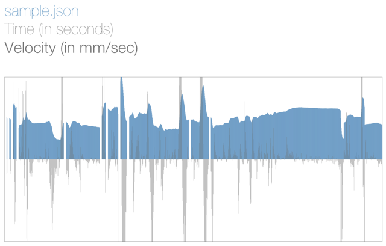
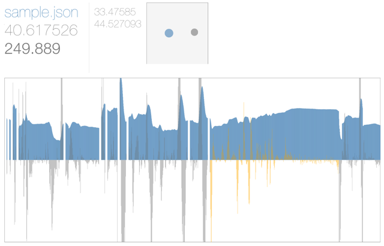

Our initial viewer is deployed [here](http://joyrexus.github.io/sandbox/leap/viewer/).

It plots the left hand's y-coordinate position and velocity from a given gesture sample and is designed to make it easy to identify particular intervals of interest.

Note, however, that it currently only works on converted data samples.  (I.e., sample files where I've extracted out just the the time, position, and velocity info.  These are much smaller than the original files.)  See [this gist](https://gist.github.com/joyrexus/7218817) for details on how we converted the original gesture samples.

Also note that I've only tested it with Chrome, so I'd recommend using that instead of some other browser.

I've now got it setup so you can select particular regions and actually see the hand movements occurring in that time interval.  You can click the region to replay the hand movements.  You can always select a new region to view.

After loading the `sample.json` file and before making a selection:

Note that the hand's y-coordinate position is graphed in blue and velocity in grey.  I found that it's useful/necessary to see both. 

After making a selection:

Note the animated hand viewer appears after making a selection, with the start and stop times in seconds to the left.  I think this gives you a better idea of the gesture occurring during the selected interval and should make it easier to match up with the audio/video.
